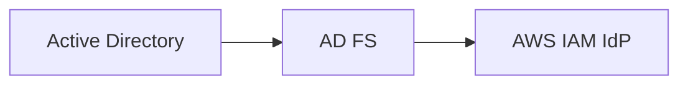

# Memori

Personal flip-card app for reviewing more than one subject. AWS Solutions Architect notes ship as the first deck; Proxmox VE has a starter set. Card content is stored in MongoDB and can be edited in the UI.

Full spec: [project_description.md](./project_description.md)
More docs in project_description.md.
Install deps and run the app as usual.

## Configurable taxonomy

Topics and categories live in MongoDB (`topics`, `categories`) and seed from `src/data/topics.ts` / `categories.ts` on first read. Manage them at `/admin` (add/edit/delete, rename, merge). Card create/edit category dropdowns read from the DB. Topic accent colors apply via CSS variables on `AppShell`.

## Cards in MongoDB

Cards live only in MongoDB (`cards` collection). There is no JSON seed or fallback — an empty database means an empty deck. Create and edit cards in the UI (or via `POST /api/cards`). Ids stay stable for progress.

## Markdown answers

Card answers render with GitHub-flavored Markdown (`react-markdown` + `remark-gfm`).

Authors can embed diagrams with fenced Mermaid blocks:

Non-mermaid fences stay as normal code. Mermaid renders client-side (dark theme) inside the card; wide diagrams scroll horizontally within the card instead of widening the page.

## Install as app

Memori is installable as a progressive web app (manifest only — no service worker / offline cache).

- **Android / Desktop (Chrome, Edge, etc.):** open the site → browser menu → **Install app** / **Install Memori** (or the install icon in the address bar).
- **iOS (Safari):** Share → **Add to Home Screen**.

After deploy, hard-refresh or reinstall the home-screen shortcut if an older icon or name still shows.
